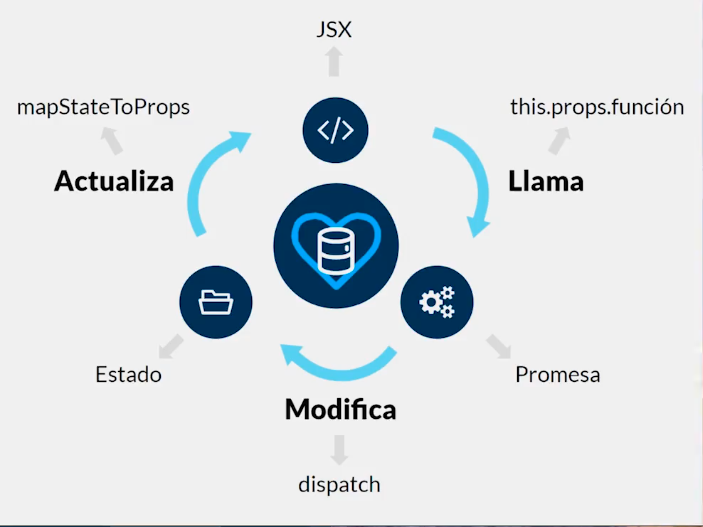

# Redux

## ¿Qúe es Redux, cuándo usarlo y por qué?

Redux es una herramienta de uso libre que nos deja almacenar todo el estado de una aplicación en un sólo lugar.

Sis principios son:
- Almacenamiento
- Inmutable
- Centralizado

Redux es un contenedor predecible del estado de aplicaciones JavaScript. Te ayuda a escribir aplicaciones que se comportan de manera consistente, corren en distintos ambientes (cliente, servidor y nativo), y son fáciles de probar.

Otras bibliotecas que permiten trabajar con información son:
- Relay
- Apolo


[Redux](https://es.redux.js.org/) es un contenedor predecible del estado de aplicaciones JavaScript.
Puedes usar Redux combinado con React, o cual cualquier otra librería de vistas. Es muy pequeño (2kB) y no tiene dependencias.


## Introducción: las fases de Redux

Los cuatro pilares de Redux son:
- **Store**: Almacenamiento
- **Reducers**: Estados
- **Action Creators**: Funciones
- **Componente**: Código JSX


## Store 

El *store* tiene las siguientes responsabilidades:
- Contiene el estado de la aplicación
- Permite el acceso al estado vía `getState()`
- Permite que el estado sea actualizado vía `dispatch(action)`
- Registra los listeners vía `subscribe(listener)`
- Maneja la anuliación del registro de los listeners via el retorno de la función de `subscribe(listener)`


**Instalación de Redux**

Para usar redux, necesitamos instalar la librería

- `npm install redux react-redux`


## Reducers

Las *Action Creators* describen que algo pasó, pero no especifican cómo cambió el estado de la aplicación en respuesta. Esto es trabajo de los reducers.

El *Provider* es el componente de Redux en el cual encerraremos nuestra aplicación para que puedan comunicarse los componentes entre ellos.

**Creación de los reducers**

Vamos a la carpeta `src` y creamos un directorio llamado ``reducers`, todo en minúscula. Dentro de él creamos un archivo llamado `index.js` 

- [reducers/index.js](blog/src/reducers/index.js)


## Conexión a un componente

1. Como puntos previos ya en esta clase debes tener instalado redux y haberlo configurado en el index.js de tu app

2. Importa el método connect de React Redux
`import { connect } from "react-redux"`

3. Mapea el estado de redux a los props del componente llamando a los reducers que te interesen usar, en este caso para mi fue usersReducer

```js
const mapStateToProps = (reducers) => {

  return reducers.usersReducer;

}
```

4. Exporta tu componente usando el método connect para tenerlo conectado a los reducers y actions de Redux.

```js
export default connect(mapStateToProps, {/*actions*/} )(Users);
```

- [users/index.js](blog/src/components/users/index.js)

## Action Creators

Para manejar el **action creators**, creamos una carpeta llamada **actions** dentro del directorio `src`. Allí creamos un archivo llamado `usuariosActions.js`

**dispatch** Es el que va a disparar esa llamada y va a contactar al reducer para hacer el cambio de estado.

- [actions/usuariosActions.js](blog/src/actions/usuariosActions.js)

## Redux Thunk

Redux Thunk permite a las *action creators* invertir el control despachando funciones. Van a recibir dispatch como argumento y capaz llamarlo asíncronamente. Estas funciones son llamas *thunks*.

- `npm install redux-thunk`

- [src/index.js](blog/src/index.js)


## Explicación teórica: ciclo completo de Redux

Cuando nuestro componente terminar de cargar (`componentDidMount`) llama al *Action Creator*, luego el Action Creator contiene la promesa, trae los datos necesarios y luego va y modifica al *Reducer* para que actualice el estado usando *dispatch()* y luego lo actualizamos en el componente con el *mapStateToProps*.

